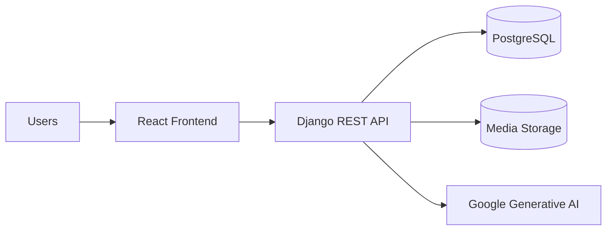

# Medi-Lin-Q

Medi-Lin-Q is a healthcare management platform built with Django REST Framework and React. It supports patient, doctor, hospital admin, and staff workflows for registration, authentication, appointment booking, medical reports, dashboards, notifications, and AI-assisted health features.

## Project Overview

The system provides a role-based healthcare experience with separate backend and frontend layers. The backend exposes a REST API for authentication, profiles, booking, reports, prescriptions, analytics, and hospital operations. The frontend is a Vite-powered React single-page app that consumes the API and renders role-specific dashboards.

## Problem Statement

Healthcare teams often need one platform to manage patient onboarding, appointment scheduling, report handling, and hospital operations without fragmenting the experience across multiple tools.

## Solution

Medi-Lin-Q centralizes these workflows in a single platform with JWT authentication, profile completion flows, booking support, and AI-assisted report and chatbot features.

## Key Features

- Role-based authentication for patients, doctors, hospital admins, and staff
- Patient, doctor, and hospital profile management
- Appointment booking and scheduling workflows
- Medical report upload and review flows
- Prescriptions, notifications, and dashboard analytics
- AI-assisted report summarization and chatbot support

## Architecture Diagram



## Technology Stack

- Backend: Django, Django REST Framework, SimpleJWT, django-filter, corsheaders
- Frontend: React 18, Vite, React Router, axios, jwt-decode, lucide-react, recharts
- Database: PostgreSQL
- AI: Google Generative AI (Gemini)

## Folder Structure

```
/
├── manage.py
├── medilinq_config/
├── api/
├── frontend/
├── docs/
├── scripts/
├── medical_reports/
└── README.md
```

## Installation

1. Create and activate a Python virtual environment.
2. Install backend dependencies.
3. Install frontend dependencies in `frontend/`.
4. Configure environment variables for Django, PostgreSQL, and Google API access.

## Configuration

Set backend secrets and local settings through environment variables. Do not hardcode production credentials in `settings.py`.

Required values typically include:

- Django secret key
- Database name, user, password, host, and port
- Google Generative AI API key
- Allowed hosts and CORS settings

## Running Locally

1. Start the Django backend from the project root.
2. Start the React frontend from `frontend/`.
3. Use the frontend app to authenticate and exercise the API flows.

## API Overview

- `/api/login/` and `/api/login/refresh/` for authentication
- `/api/profile/` endpoints for user profile workflows
- `/api/booking/` endpoints for appointment discovery and booking
- `/api/medical-reports/` endpoints for report access
- `/api/notifications/` endpoints for notifications

## Authentication

Authentication uses JWT access and refresh tokens. The frontend stores tokens locally, attaches them to API requests, and refreshes access tokens when needed.

## AI Features

- Medical report summarization
- Health chatbot responses with graceful fallback when the model is unavailable

## Screenshots

Add product screenshots here once UI capture assets are available.

## Future Scope

- Environment-based configuration for all secrets
- Consolidation of duplicated booking flows
- Stronger API client abstraction in the frontend
- Expanded test coverage for appointment and profile workflows

## Contributors

Initial implementation by the project team.

## License

See [LICENSE](LICENSE).