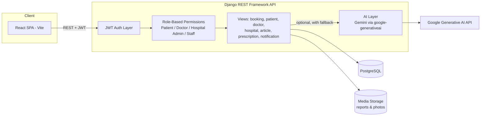

<div align="center">

# 🩺 Medi-Lin-Q

### A role-based healthcare operations platform for patients, doctors, and hospital administrators


**Medi-Lin-Q centralizes patient bookings, doctor workflows, and hospital operations into one JWT-secured platform — with AI features layered in to make medical reports and health guidance easier to understand.**

</div>

---

## Table of Contents

- [Product Overview](#product-overview)
- [Product Vision](#product-vision)
- [Key Features](#key-features)
- [AI Features](#ai-features)
- [User Roles & Workflows](#user-roles--workflows)
- [Technology Stack](#technology-stack)
- [System Architecture](#system-architecture)
- [Folder Structure](#folder-structure)
- [Screenshots](#screenshots)
- [Security](#security)
- [Product Roadmap](#product-roadmap)
- [Installation](#installation)
- [API Overview](#api-overview)
- [Engineering Decisions](#engineering-decisions)
- [Why This Project Stands Out](#why-this-project-stands-out)
- [Contributing](#contributing)
- [License](#license)

---

## Product Overview

Hospitals routinely juggle three disconnected concerns at once: patients trying to find a doctor and book a slot, doctors trying to track their patient list and history, and administrators trying to keep staff, wards, and appointment volume under control. Most college-project healthcare apps solve one of these in isolation. **Medi-Lin-Q solves all three under a single authentication and data model**, with each role getting a purpose-built dashboard instead of a generic CRUD screen.

**Target users:**

| Role | Core need | What Medi-Lin-Q gives them |
|---|---|---|
| **Patient** | Find a doctor, book an appointment, understand their own reports | Multi-step booking wizard, appointment history, prescriptions, health analytics, an AI report explainer |
| **Doctor** | See who's on today's list, review history quickly | Patient directory, appointment queue with status actions (confirm/reschedule), an AI-generated patient summary before a consult |
| **Hospital Administrator** | Run the facility — staff, doctors, wards, appointment load | Staff & doctor directories, ward/bed occupancy, appointment oversight, department-level analytics |

The platform is a two-tier system: a **Django REST Framework API** as the single source of truth for all roles, and a **React (Vite) single-page app** that renders a different dashboard depending on the JWT's embedded role claim.

## Product Vision

Medi-Lin-Q is built around three long-term ideas, each partially realized today:

1. **One login, every healthcare workflow.** Rather than separate portals for patients, clinicians, and admin staff, one authentication system and one appointment/record schema back all three experiences — reducing the integration tax hospitals normally pay to connect these tools.
2. **Health information patients can actually read.** Lab reports and clinical notes are written for clinicians, not patients. The report-summary and chatbot features exist specifically to translate that language into plain English, with a clear "consult a doctor" boundary built into every AI response.
3. **Operational visibility for administrators.** Ward occupancy, doctor caseload, and appointment trends are computed directly from live appointment/bed data rather than a static export, so the admin dashboard reflects the current state of the hospital.

## Key Features

**Patient Experience**
- Multi-step appointment booking: select hospital → doctor → available slot → confirm
- Appointment history with filtering by status and time period
- Medical report upload/download and prescription history
- Health analytics dashboard (appointment, prescription, and report trends)
- AI-assisted report summaries and a health-question chatbot

**Doctor Workspace**
- Patient directory scoped to the doctor's own patients
- Appointment queue with confirm / reschedule / view-details actions
- AI-generated pre-consult patient summary built from report and prescription history
- Prescription creation tied to a specific appointment
- Article publishing for patient-facing health content

**Hospital Administration**
- Doctor and staff directories with add/remove management
- Ward and bed occupancy tracking
- Hospital-wide appointment oversight
- Analytics: monthly visit trends, department/specialization distribution, bed occupancy by ward

**Platform-wide**
- Role-based JWT authentication (`patient`, `doctor`, `hospital_admin`, `staff`)
- Two-step registration (account creation, then role-specific profile completion)
- In-app notifications
- Light/dark theme toggle (persisted via `localStorage`)

## AI Features

Medi-Lin-Q integrates **Google's Generative AI (Gemini)** in three places, all built with the same pattern: try the model, and if the API key is missing or the call fails, fall back to a rule-based response rather than showing an error.

| Feature | Who uses it | What it does |
|---|---|---|
| **Medical Report Summarizer** | Patient | Sends a report's type, description, and date to Gemini and asks for a 2–3 sentence, non-technical summary with any recommendations |
| **Health Chatbot** | Patient | Answers free-text health questions, injecting the patient's blood group and allergies as context, with an explicit instruction to the model to recommend seeing a doctor for serious concerns |
| **AI Patient Summary** | Doctor | Compiles a patient's report history and prescriptions into a single prompt so a doctor gets a quick pre-consult brief instead of scrolling through raw records |

**Responsible-use notes reflected in the code itself:**
- Every AI call is wrapped in a `try/except`; failures degrade to a deterministic fallback summary/response rather than blocking the user.
- The chatbot's system prompt explicitly instructs the model to recommend professional consultation for serious concerns — the assistant is positioned as informational, not diagnostic.
- The health analytics dashboard is **not** AI-generated — appointment counts, prescription totals, and monthly trends are computed directly from the database. AI is reserved for the two narrow tasks above, not layered on top of every screen as a marketing feature.

## User Roles & Workflows

**Patient journey:** Sign up → complete patient profile (blood group, allergies, emergency contact) → browse hospitals → pick a doctor → pick an open slot → confirm booking → track status from the appointments dashboard → upload/view reports → optionally ask the AI assistant to explain a report or answer a health question.

**Doctor journey:** Sign up → complete doctor profile (specialization, qualification, experience, availability) → get assigned to a hospital → review incoming appointment requests → confirm, reschedule, or complete them → open a patient's record and request an AI-generated summary before the visit → issue a prescription against the appointment.

**Hospital administrator journey:** Sign up → complete hospital profile (license number, contact info, operating hours) → add doctors and staff to the directory → manage wards and bed counts → monitor the appointment queue across all doctors → review analytics (visit trends, specialization load, occupancy).

## Technology Stack

| Layer | Technology |
|---|---|
| **Frontend** | React 18, Vite, React Router v6, Axios, `jwt-decode`, Recharts, Lucide React |
| **Backend** | Django 5, Django REST Framework, `django-filter`, `django-cors-headers` |
| **Database** | PostgreSQL (via `psycopg2-binary`) |
| **Authentication** | `djangorestframework-simplejwt` — 24h access / 30-day refresh tokens, rotation + blacklisting on refresh |
| **AI** | Google Generative AI (`google-generativeai`, Gemini models) |
| **Data/analytics** | `pandas` (doctor-side cohort/age-group analytics), `python-dateutil` |
| **Media handling** | Pillow (profile photos, uploaded report files) |
| **Dev tooling** | ESLint, Vite dev server, Django's built-in dev server |

## System Architecture



## Folder Structure

```
MEDI-LIN-Q/
├── manage.py
├── requirements.txt
├── medilinq_config/          # Django project settings, root URLconf, env loader
├── api/                       # Single Django app containing the whole domain
│   ├── models.py              # User, profiles, Appointment, TimeSlot, MedicalReport,
│   │                           # Prescription, Ward, Bed, Notification, Article
│   ├── permissions.py         # IsPatientUser, IsDoctorUser, IsHospitalAdminUser, ...
│   ├── serializers/            # Split by domain: auth, patient, doctor, hospital, booking, ...
│   ├── views/                  # Split by domain: auth, patient, doctor, hospital, booking, ...
│   ├── urls/                   # Split by domain, composed in urls/__init__.py
│   └── migrations/
├── frontend/
│   ├── src/
│   │   ├── pages/               # Login, Signup, Home, Dashboard, CompleteProfile flows
│   │   ├── components/          # Role dashboards: Patient*, Doctor*, Hospital*
│   │   ├── contexts/            # AuthContext (JWT decode/refresh), ThemeContext (dark mode)
│   │   └── utils/api.js         # Axios instance with token attach + refresh interceptor
│   └── vite.config.js
└── medical_reports/           # Uploaded report files (media)
```

## Screenshots

| Landing Page | Specialties & Quick Access |
|---------------|----------------------------|
|  |  |

| Login & Signup | Patient Health Analytics |
|----------------|--------------------------|
|  |  |

| Appointment Booking | Patient Appointments |
|---------------------|----------------------|
|  |  |

| Electronic Health Records | AI Report Summarisation |
|---------------------------|-------------------------|
|  |  |

| Doctor Patient Directory | Doctor Appointment Directory |
|--------------------------|------------------------------|
|  |  |

| Hospital Appointments | Hospital Dashboard |
|-----------------------|--------------------|
|  |  |

| Hospital Staff Directory |
|--------------------------|
|  |

## Security

Implemented in the current codebase:

- **JWT authentication** via `djangorestframework-simplejwt`, set as the default DRF authentication class
- **Refresh token rotation with blacklisting** — a used refresh token cannot be replayed
- **Custom role-based permission classes** (`IsPatientUser`, `IsDoctorUser`, `IsHospitalAdminUser`, `IsDoctorOrHospitalAdmin`) enforced per-endpoint, so a patient token cannot hit doctor/admin views
- **Environment-variable configuration** for the Django secret key, database credentials, allowed hosts, and the Google AI API key, loaded from a local `.env` file that is not committed
- **Scoped querysets** — e.g., a doctor's patient list is filtered to patients with an appointment under that doctor, not the whole database

**Known dev-mode gaps, called out honestly:** `CORS_ALLOW_ALL_ORIGINS` currently defaults to `True` and `DJANGO_DEBUG` defaults to `True` in `settings.py` — appropriate for local development, but both should be locked down via environment variables before any real deployment.

## 🚀 Product Roadmap

Medi-Lin-Q is envisioned as an intelligent healthcare ecosystem that evolves beyond hospital management into AI-assisted healthcare, smart hospital operations, and connected digital health services.

| Phase | Strategic Focus | Planned Enhancements |
|--------|-----------------|----------------------|
| **🩺 Phase 1** | **Intelligent Patient Experience** | • Universal Patient ID (UPID) across the platform<br>• AI-powered doctor recommendations<br>• Smart appointment reminders<br>• Digital health timeline<br>• Emergency SOS & ambulance booking |
| **🤖 Phase 2** | **AI-Assisted Healthcare** | • OCR-based medical report extraction<br>• AI symptom pre-assessment *(non-diagnostic)*<br>• AI-generated patient summaries for doctors<br>• Personalized health insights<br>• Medication & follow-up recommendations |
| **🏥 Phase 3** | **Smart Hospital Operations** | • Live doctor availability tracking<br>• Real-time ICU, OT & ward occupancy<br>• Smart bed allocation<br>• Queue prediction & appointment optimization<br>• Hospital operational dashboards |
| **🌐 Phase 4** | **Connected Healthcare Ecosystem** | • Secure telemedicine consultations<br>• Pharmacy & laboratory integration<br>• Insurance integration<br>• Wearable device connectivity<br>• Home healthcare & remote patient monitoring |
| **📊 Phase 5** | **Predictive Healthcare Intelligence** | • Predictive hospital analytics<br>• Bed occupancy forecasting<br>• Disease trend analysis<br>• Resource optimization<br>• Executive healthcare dashboards |

---

### 🌍 Long-Term Vision

Medi-Lin-Q aims to evolve into a comprehensive **AI-powered healthcare operating system** that connects patients, clinicians, hospitals, emergency services, pharmacies, laboratories, and insurers through a secure and interoperable digital ecosystem.

**Future platform capabilities include:**

- 🚑 One-Tap Emergency SOS with live ambulance tracking
- 🏥 Live monitoring of ICU, OT, ward, and emergency bed availability
- 👨‍⚕️ Real-time doctor availability and emergency duty tracking
- 🆔 Universal Patient ID (UPID) for seamless cross-hospital healthcare records
- 💻 End-to-end telemedicine with secure video consultations
- 🤖 AI-powered clinical decision support and explainable medical insights
- 📊 Predictive analytics for hospital operations and resource planning
- 🔗 Cross-hospital interoperability with longitudinal patient records
- ⌚ Wearable device integration for continuous health monitoring
- 🌐 Multilingual AI healthcare assistant for improved accessibility
## Installation

**Prerequisites:** Python 3.11+, Node.js 18+, PostgreSQL 14+

**Backend**
```bash
python -m venv venv
source venv/bin/activate        # venv\Scripts\activate on Windows
pip install -r requirements.txt
```

**Environment variables** — create a `.env` file in the project root:
```env
DJANGO_SECRET_KEY=your-secret-key
DJANGO_DEBUG=True
DJANGO_ALLOWED_HOSTS=localhost,127.0.0.1
DATABASE_NAME=medilinq_db
DATABASE_USER=postgres
DATABASE_PASSWORD=your-password
DATABASE_HOST=localhost
DATABASE_PORT=5432
GOOGLE_API_KEY=your-google-generative-ai-key
CORS_ALLOW_ALL_ORIGINS=True
```

**Database**
```bash
python manage.py migrate
python manage.py createsuperuser
```

**Frontend**
```bash
cd frontend
npm install
npm run dev
```

**Run locally:** start the Django dev server from the project root (`python manage.py runserver`) and the Vite dev server from `frontend/` (`npm run dev`); the frontend expects the API at `http://127.0.0.1:8000`.

## API Overview

All endpoints are namespaced under `/api/`. Selected groups:

| Group | Example endpoints |
|---|---|
| **Auth** | `POST /api/register/`, `POST /api/login/`, `POST /api/login/refresh/` |
| **Patient** | `/api/dashboard/`, `/api/analytics/`, `/api/medical-reports/`, `/api/prescriptions/`, `/api/ai-chatbot/`, `/api/reports/<id>/ai-summary/` |
| **Booking** | `/api/booking/workflow/hospitals/`, `/.../doctors/`, `/.../schedule/`, `/.../book/` (4-step booking flow) |
| **Doctor** | `/api/doctor/dashboard-summary/`, `/api/doctor/patients/`, `/api/patients/<id>/summary/` (AI summary), `/api/doctor/appointments/` |
| **Hospital** | `/api/hospital/doctors/`, `/api/hospital/staff/`, `/api/hospital/wards/`, `/api/hospital/analytics/` |
| **Shared** | `/api/notifications/`, `/api/articles/` |

## Engineering Decisions

- **One Django app, split into domain submodules.** Rather than one flat `views.py`/`serializers.py`/`urls.py`, each is split into `auth_*`, `patient_*`, `doctor_*`, `hospital_*`, `booking_*`, etc. This keeps the single-app simplicity (no cross-app FK friction) while still giving each role's logic its own file.
- **Role lives on the `User` model, not on separate auth tables.** A single `AbstractUser` subclass with a `role` field plus one-to-one profile models (`PatientProfile`, `DoctorProfile`, `Hospital`, `StaffProfile`) keeps auth simple while letting each role carry its own domain-specific fields.
- **Custom human-readable IDs (`P-XXXXX`, `D-XXXXX`, `HOSP-XXXXX`) generated on save**, separate from the numeric primary key — useful for display and support conversations without exposing internal IDs.
- **AI calls always degrade gracefully.** Every Gemini integration point catches its own exceptions and falls back to a deterministic response, so a missing API key or an upstream outage never breaks the user-facing feature — it just becomes less "smart" temporarily.
- **Long-lived JWTs (24h access / 30-day refresh) with rotation.** Chosen for the demo/project context; a production deployment would likely shorten the access-token lifetime and pair it with silent refresh, which the frontend interceptor already supports.

## Why This Project Stands Out

- **Software engineering:** a modular Django REST API with domain-split urls/views/serializers, custom permission classes enforcing role isolation, and a JWT flow with rotation/blacklisting rather than default settings.
- **Product thinking:** three distinct user roles were designed around their actual workflows (booking vs. triage vs. operations), not as three copies of the same CRUD screen.
- **AI product thinking:** AI is scoped to two concrete pain points — patients not understanding medical language, and doctors needing a fast pre-consult brief — with an explicit fallback path instead of an "AI everywhere" approach.
- **Healthcare-domain awareness:** the data model reflects real clinical relationships (appointments → prescriptions → medications, wards → beds → patient assignment) rather than a generic booking schema.

## Contributing

Contributions are welcome. To propose a change:

1. Fork the repository and create a feature branch (`git checkout -b feature/your-feature`).
2. Keep backend changes scoped to the relevant `api/views|serializers|urls` submodule.
3. Run the existing test scripts relevant to your change before opening a PR.
4. Open a pull request describing the change, the role(s) it affects, and any new environment variables it introduces.

## License

This project is licensed under the [MIT License](LICENSE).
